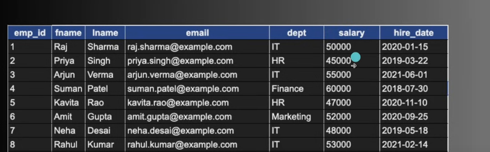

// list - postgress

# List down all exiting data base

1. SELECT datname from pg_database
   or
   \l

2. to change current databse

\c db_name

3. to delete database

drop database sb_name

# Crud data base

a. Create

# create table tableName (

    id int,
    name varchar(100)
    city varchar (100)

)

# insert data to database

-single data
insert into person(id,name,city) values (101,'shub','pune');

- multiple data entry

insert into person(id,name,city) values (102,'akash','pune')
(103,'vaibh','pune');

you can check the details of table using \d tableName

b. Read

# to view all the data

select \* from person;

# to view only certain column

Select name from person ;
select name,city from person ;

c. Update

# update person

set name='changeName'
where id=101

d. Delete

# delete from person

where id=103

DATATYPES
An attribute that specifies the type of data
in a column of our database -table

Modst widely used
Numeric - int ,double ,float ,decimal
String - varchar
Date - Date
Boolean - BOOLEAN

# CONSTRAINT

- rule applied to a column is called contraint  
  a. Primary key
  b. Not null
  c. Default
  d. Serial
  e. Unique

# Exercise create this table



```
create table employee (
 emp_id Serial PrimaryKey ,
 fname varchar(50) not null,
 lname varchar(50) not null,
 email varchar(100) Unique not null,
 dept varch (50) ,
 salary decial(10,2) dafault 20000.00,
 hire_date date not null default CURRENT_DATE
)

```

# Data Refining - Common Clauses

1. Where

- relation operators
  where dept='' or dept='',
  and ,
  logcal opratore - >= ,<= ,!= ,=

  dept IN ('hr','finance')
  dept NOT IN ('hr','finance')

  select \* from epmployees where slary 30000 and 40000;

2. Distinct

- get distinct values
  select distict dept from employees ;

3. Order by

- \* select \* from employees order by fname asc| desc

4. Limit

-\ -select \* from employees order by fname desc limit 2 ;

5. Like

# Agregate function

1. Count
2. Sum
3. Avg
4. Min
5. Max
